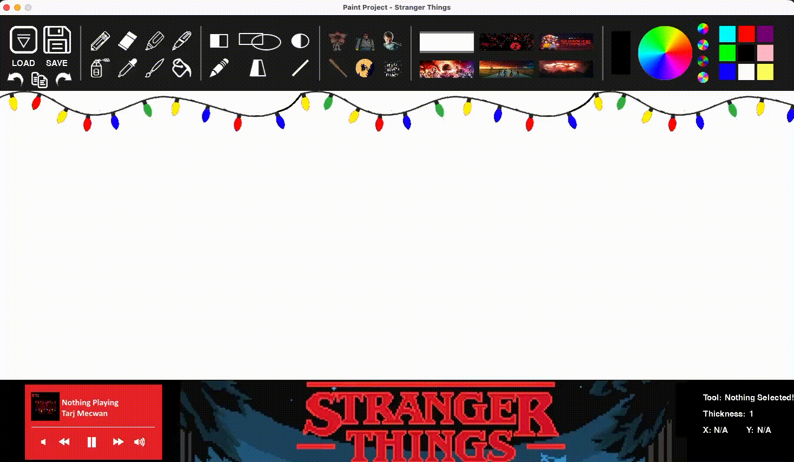

# 🎨 Stranger Things Paint (Python)

## 🧠 About This Project

I’m updating this README over 8 years later, and honestly… I always forget how proud I was of this project.

Since then, I’ve built bigger, more complex, and more useful applications. But this one always hits different. This was from my very first coding class in high school (Grade 11) and my first ever Python project.

Looking back, I definitely went over the top. I even added a music controller, and the funny part is… even after coding it, I barely understood how it worked.

Still, this project represents where everything started for me.

---

## 🎯 Objective

The assignment was simple:

- Create a Microsoft Paint clone
- Pick a theme
- Include:
  - At least 5 tools
  - Load & Save functionality
- Bonus marks for going above and beyond

I chose a Stranger Things theme, since it had just come out at the time and I really liked it.

Safe to say… I went way beyond the requirements.

---

## ✨ Features

### 🖌️ Drawing Tools
- Pencil  
- Eraser  
- Highlighter  
- Fountain Pen  
- Spray Can  
- Eye Dropper  
- Brush  
- Crayon  

### 🎨 Shape Tools
- Rectangle Tool  
- Circle Tool  
- Polygon Tool  
- All shapes can be:
  - Filled  
  - Not filled  

### 🪣 Fill Tool
- Works like a paint bucket  
- I think I implemented it by checking surrounding pixels with the same color and filling them  
- Not gonna lie… I don’t fully remember how I made it work, but it somehow worked perfectly  

---

## 🧩 Extras (Where I Went Crazy)

- 🎬 Stranger Things Theme  
- 🌌 6 Custom Backgrounds  
  - The eraser replaces with the background instead of white  
  - Completely unnecessary… but kinda cool  
- 🎨 Multiple Color Wheels  
  - Most students had one  
  - I added a bunch just because why not  
- 💡 Animated Christmas Lights across the top  
- 🧷 6 Custom Stickers (Stranger Things themed)  
- 🎵 Music Controller (still don’t know how I made that work)  
- 🔁 Undo / Redo  
- 📋 Copy Tool  
- 📂 Load Image  
- 💾 Save Image
   

---

## 🚀 How to Run

1. Install Python  
2. Open the project in IDLE (or any Python IDE)  
3. Run the main file  

That’s it.

---

## 💭 Final Thoughts

This project isn’t perfect. It’s messy, over-engineered, and honestly kind of chaotic.

But it represents:
- My first time building something real  
- My first exposure to Python  
- The moment I realized I actually enjoyed coding  

Even after years of experience, this one still feels special.

---

## 🧑‍💻 Author

**Tarj Mecwan**
